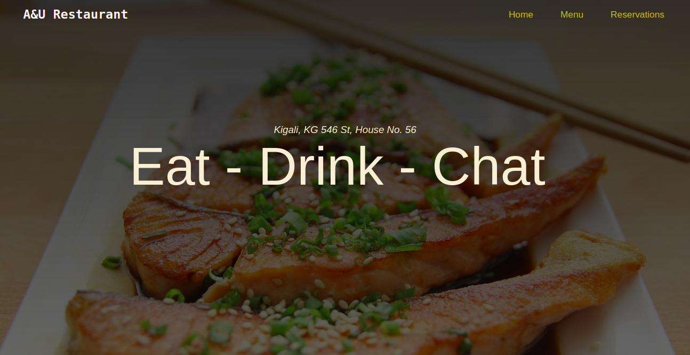
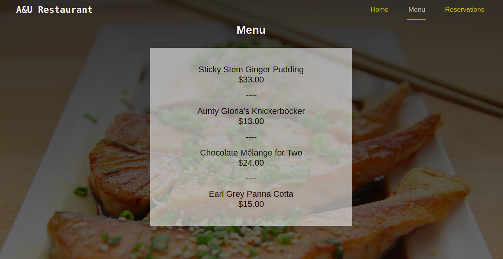
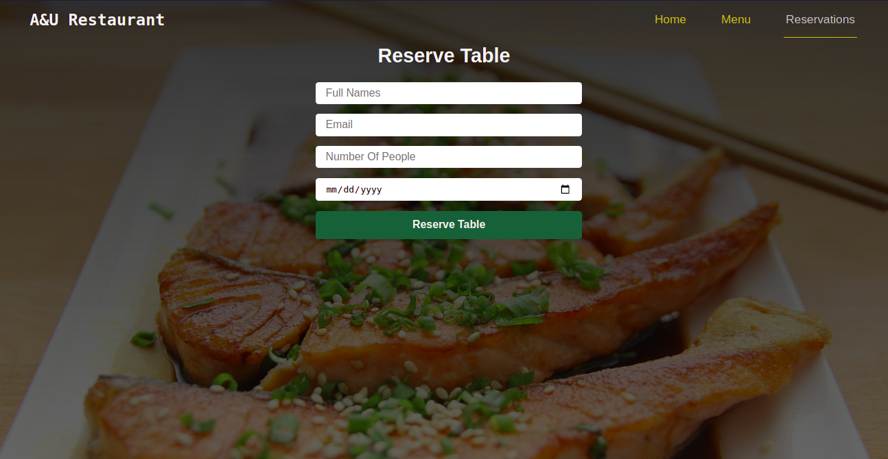

# Restaurant-Page

> In this project, I have built a restaurant page. It has a home page with details about the restaurant, the menu, as well as the reservation form.

## Built With

- HTML5
- CSS3
- JavaScript
- Webpack

## Live Demo

[Live Demo Link](https://raw.githack.com/Blaise-Shyaka/Restaurant-Page/restaurant-page-features/dist/index.html)

## Getting Started

In order to run locally this project, please type the following commands over the terminal in Linux or Mac or the Windows cmd console:

- `git clone https://github.com/Blaise-Shyaka/restaurant-page.git`
- `cd Restaurant-Page`
- `npm install`

After running the previous commands, to see the web application in the browser go to the `dist` folder and open the `index.html` file.

## Authors

👤 **Blaise Pascal Shyaka**

- Github: [@Blaise-Shyaka](https://github.com/Blaise-Shyaka)
- Twitter: [@blaiseshyaka95](https://twitter.com/blaise_shyaka95)
- Linkedin: [@blaise-pascal-shyaka](https://www.linkedin.com/in/blaise-pascal-shyaka)

## 🤝 Contributing

Contributions, issues, and feature requests are welcome!

Feel free to check the [issues page](https://github.com/Blaise-Shyaka/restaurant-page/issues).

## Show your support

Give a ⭐️ if you like this project!

## 📝 License

This project is [MIT](./LICENSE) licensed.